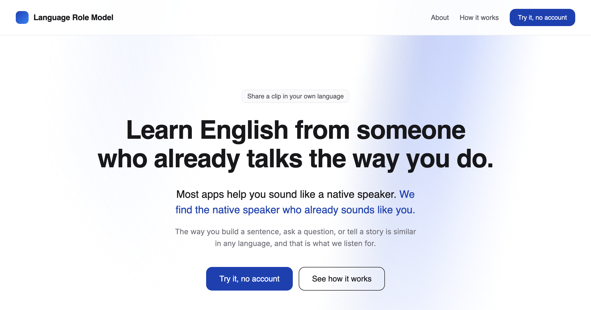
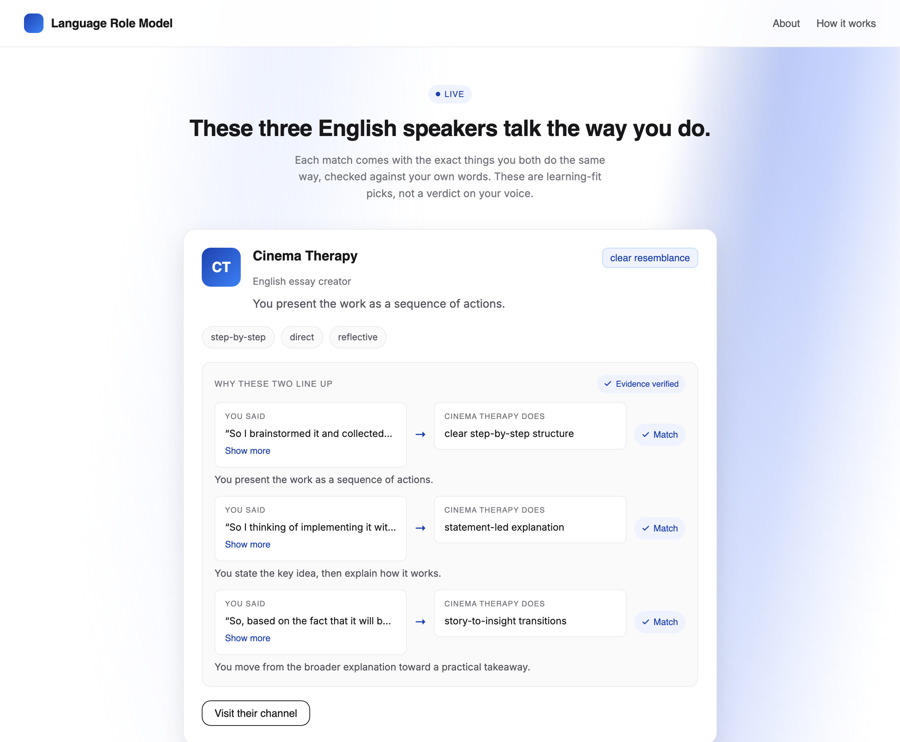
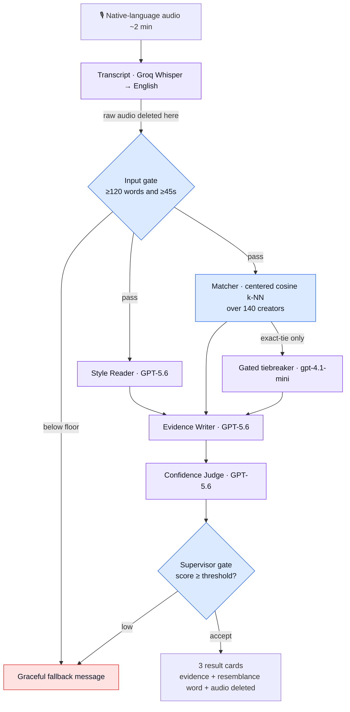

<div align="center">

# 🎧 Your Ideal Role Model

### Most apps help you sound like a native speaker.<br/>This one finds the native speaker who already sounds like **you**.


[**See it running**](#️-see-it-running-for-judges) · [Why it's novel](#-whats-novel) · [Why GPT-5.6](#-why-this-required-gpt-56) · [How it works](#️-how-it-works) · [How Codex helped](#️-how-codex-helped-us-build-it) · [Proof](#-proof)

</div>

<p align="center">
  
</p>

An **English-learning app for adults**. You record about two minutes of yourself talking in _your own native language_. The app reads _how you talk_ — how you structure ideas, hedge, question, persuade — and matches you to real English-speaking YouTube creators whose speaking style resembles yours, so you can shadow someone who already talks the way you do. Direction is always **native-language in → English-creator out**.

Every match comes with a checkable **evidence chain** (_You said → Creator does → Match_), a resemblance shown as a **word** (_strong / clear / partial_ — never a fake percentage), and a **privacy promise**: your raw audio is deleted the instant it is transcribed.

| | |
|---|---|
| 🎬 **Demo video (< 3 min)** | [Watch on YouTube](https://youtu.be/Pq7AprAbbNg) |
| 🧩 **Codex `/feedback` session ID** | `019f805c-97be-7b12-afab-bc1222712961` |
| 🏷️ **Category** | Education |
| 💻 **Setup** | Runs fully locally — no deployment, no account, and **no API keys needed to see a full demo** |

---

## 🎯 The problem

Intermediate adult learners plateau because every product hands them the **same generic native-speaker template** to imitate. Copying a delivery that isn't yours is exhausting and it doesn't stick — the learner sounds like a worse copy of someone else instead of a fluent version of themselves.

**The insight:** you already have a communication style in your first language. The fastest way to fluency isn't to erase it — it's to find an English speaker who _already_ communicates like you, and learn from them. This app turns "who should I learn from?" from a guess into an evidence-backed match, which is exactly where AI-for-education earns its place: personalization no static curriculum can do.

## ✨ What's novel

Three deliberate reversals of how a language app normally works:

1. **Native-language in → English-creator out.** You speak your _own_ language; we never grade your English. We read the idiolect underneath the words and point it at English role models. Most tools do the opposite.
2. **Resemblance is a word, not a percentage.** Style similarity isn't precise to two decimals, so we don't fake it. Matches read _strong / clear / partial_ — honest about what an embedding can and can't claim.
3. **Every claim is a grounded, verified chain.** The app never says "you're both confident." It shows _You said_ `"<your real sentence>"` → _Creator does_ `<our authored descriptor>` → _Match_ — built only from **your own quotes**, then independently checked by a **Confidence Judge** before it ships. Nothing is invented.

## 🤖 Why this required GPT-5.6

Embeddings are good at finding a shortlist of creators with similar communication patterns. They cannot show a learner **why** that shortlist makes sense in language they can inspect.

GPT-5.6 does the judgment around that match: it reads how the learner organizes ideas, anchors each observation to a real sentence, turns only those observations and our authored creator descriptors into an evidence chain, then runs a separate verification pass that removes weak or generic reasons. The vector matcher still chooses the candidates; GPT-5.6 makes the explanation grounded and checkable.

It is deliberately not one giant “who matches?” prompt. The system asks three smaller questions in sequence:

1. How does this learner communicate, based on their own sentences?
2. Which supplied facts support each proposed reason?
3. Is each reason specific and verifiable enough to show?

That separation is what lets a user inspect the recommendation instead of taking a flattering AI claim on faith.

---

## ▶️ See it running (for judges)

**No API keys required.** The demo cache is pre-seeded for the bundled sample clip, so a full run returns instantly — transcript, style read, match, tiebreaker, evidence, and judge — with zero setup keys.

```bash
# 1. Backend
python -m venv .venv && source .venv/bin/activate
pip install -r backend/requirements.txt
uvicorn backend.app:app --reload --port 8000        # first run downloads the embedding model once

# 2. Frontend (new terminal)
cd web && npm install && npm run dev                # http://localhost:3000

# 3. In the browser: open the app, upload samples/kor_3min_demo.m4a → full result, no keys.
```

### 👀 What to watch

The pieces that show this is real reasoning, not a template with the user's name pasted in:

- **The evidence chain** — each card cites a real sentence id from _your_ transcript (`s4`, `s10`, …), not a generic compliment.
- **Resemblance as a word** — _strong / clear / partial_, never a percentage.
- **The gated tiebreaker actually fires** on this sample — two creators tie at an identical cosine (`0.226764`), so a cheap model re-ranks _only_ those two. It's not decoration; you can see `tiebreak_used: true` in the response.
- **The step trace** — `transcript → input gate → style reader ∥ matcher → tiebreaker → evidence → judge`, each stage timestamped.
- **"Audio deleted"** — surfaced right on the results, because the raw audio really is dropped after transcription.

<p align="center">
  
  <br><sub><b>The results screen</b> — resemblance as a word, trait chips, and the <i>You said → Creator does → Match</i> evidence chain, each row verified.</sub>
</p>

> Want the full live pipeline on your own voice? Add two API keys and record ≥ 45 s / ≥ 120 words — see [Run it locally](#-run-it-locally).

---

## 🏗️ How it works

A **deterministic supervisor** (plain Python — never an LLM) runs a fixed DAG of single-responsibility workers. The code decides _when_ each step runs and gates the results against numeric thresholds; the models only do the _judgment_ a rule cannot. That split is the whole design.



<div align="center"><sub>🟦 deterministic code (gates and matching) &nbsp;·&nbsp; 🟪 model call &nbsp;·&nbsp; 🟥 graceful degrade</sub></div>

### The agents

Five single-responsibility roles, kept apart on purpose — so each one is auditable on its own and a failure in one degrades gracefully instead of failing the whole response.

| Agent | Kind | Sole job |
|---|---|---|
| **Transcript** | Groq Whisper (no LLM) | Translate native-language audio → English. Sole owner of the audio; it's deleted the instant this returns. |
| **Style Reader** | GPT-5.6 | Read _only_ your transcript and name **how** you talk — every trait pinned to a real sentence id. |
| **Matcher** | NumPy (no LLM) | Centered cosine k-NN over the 140-creator corpus → top 3. A **gated tiebreaker** (`gpt-4.1-mini`) re-ranks only when vectors are exactly tied; on any error it falls back to the vector order. |
| **Evidence Writer** | GPT-5.6 | Build the grounded _You said → Creator does → Match_ chains, using only your quotes and our authored creator descriptors — **never a creator's real words**. |
| **Confidence Judge** | GPT-5.6 | Independently verify each evidence item and assign the resemblance word. It _classifies_; the deterministic supervisor gate decides accept / degrade. |

**Why separated?** The three GPT-5.6 calls are deliberately independent so each is auditable in isolation, and so one weak step can be regenerated or degraded without poisoning the others. A **105-second deadline** wraps the whole request, every stage has its own timeout, and any failure degrades to a neutral fallback rather than a crash.

> **Live judgment vs. stored data — not the same thing.** The vectors are used _only_ to shortlist creators. The interpretation of how you talk and every evidence line are generated **live by GPT-5.6 from your own quotes** (not a saved template), and the Confidence Judge verifies them before they reach the screen. The creator descriptors _are_ pre-authored — that's the one thing we never let a model invent.

<details>
<summary><b>Design rigor & deeper specs</b></summary>

- [`docs/reference/2026-07-20-agent-architecture-spec.md`](docs/reference/2026-07-20-agent-architecture-spec.md) — the supervisor / worker / gate design.
- [`docs/reference/design-decisions.md`](docs/reference/design-decisions.md) — why each call is split, why centering, why a word not a %.
- [`docs/reference/design-system/DESIGN.md`](docs/reference/design-system/DESIGN.md) + [`tokens.json`](docs/reference/design-system/tokens.json) — the design tokens the frontend is built on.
- [`docs/reference/PRD.md`](docs/reference/PRD.md) — product requirements and the platform-tier vision (user style memory, learning loop).

</details>

---

## 🛠️ How Codex helped us build it

We used Codex as a collaborative engineer, not simply as a code generator. The FastAPI service, reasoning pipeline, corpus tooling, and tests were built in Codex (session referenced by the `/feedback` ID above), which let the work stay focused on the decisions that changed the product rather than on boilerplate.

The important iterations were architectural and empirical:

- Ship **plain Whisper translation**, not a style-preserving translator — the "nicer" translator erased the idiolect the model needs to read.
- Keep the **three GPT-5.6 calls separate** so each is independently auditable and failures can degrade safely.
- **Center the embedding space** rather than fake the scores when matches collapsed to near-identical cosines.
- Run the LLM **tiebreaker only on genuine ties**, behind a deterministic gate, with a vector fallback.
- **Label AI-drafted vs. human-verified data honestly** instead of claiming a review that never happened.

GPT-5.6 is the product’s live reasoning layer; Codex was the development partner that helped us build and iterate on that layer. Full reasoning: [`docs/reference/design-decisions.md`](docs/reference/design-decisions.md).

---

## 📊 Proof

These are implementation and diagnostic checks, not a claim of completed human-outcome evaluation:

- **140-creator corpus**, enforced in code (`EXPECTED_CREATOR_COUNT = 140`): **10 human-verified** + **130 AI-drafted candidates**, with validation that rejects mislabeled rows.
- **Centering works:** nearest-neighbor cosine dropped from **0.997 → 0.95**, so near-identical styles actually separate (documented in `design-decisions.md`).
- **The tiebreaker genuinely fires** on the bundled sample — two creators tie at cosine `0.226764`; the response records `tiebreak_used: true`.
- **A full live run of the sample finished in ~57 s**, comfortably under the **105 s** deadline (from the seeded step trace).
- **Green backend test suite** — `pytest backend/tests` (corpus + pipeline coverage).

---

## 💻 Run it locally

**Prerequisites:** Python 3.11+, Node 18+. For processing _new_ audio you also need two keys: `GROQ_API_KEY` (free tier) and `OPENAI_API_KEY`. The bundled sample needs neither.

### 1. Backend (FastAPI)

```bash
python -m venv .venv && source .venv/bin/activate
pip install -r backend/requirements.txt

cp .env.example .env          # then paste GROQ_API_KEY and OPENAI_API_KEY (optional for the sample)
uvicorn backend.app:app --reload --port 8000
```

On first start the style-embedding model (`StyleDistance/styledistance`) downloads once. The server starts fine without keys; keys are only needed to process _new_ audio.

### 2. Frontend (Next.js 15 · React 19)

```bash
cd web
npm install
npm run dev                   # http://localhost:3000
```

The UI calls the backend at `http://127.0.0.1:8000` by default. If yours runs elsewhere, set `NEXT_PUBLIC_BACKEND_URL`.

### 3. Sample data (no keys)

A sample recording ships at **`samples/kor_3min_demo.m4a`** (~2 min, Korean). The demo cache is pre-seeded for exactly this file: `/match` matches the upload's SHA-256 against the cache and returns the prepared result instantly — **a full demo run with no API keys.** Upload it at `http://localhost:3000` and you get three matches, evidence chains, and resemblance words.

To run the **full live pipeline** on your own audio, set both keys and upload any recording that's **≥ 45 s and ≥ 120 words**. Unknown recordings are never cached; they run the real pipeline.

<details>
<summary><b>Rebuild the data (optional)</b></summary>

```bash
python -m backend.build_corpus          # rebuild corpus.npz + quality report (centered space)
python -m backend.build_descriptors     # regenerate long style descriptions (needs OPENAI_API_KEY)
python -m backend.seed_demo_cache samples/kor_3min_demo.m4a   # re-seed the demo cache (needs keys)
python -m pytest backend/tests          # backend test suite
```

</details>

---

## 🗂️ Creator corpus (honest labeling)

140 creators: **10 human-verified** (directly observed by the builder, from their own subscriptions) and **130 AI-drafted candidates** (builder-reviewed, labeled as candidates — not claimed as vetted). Style is scored on a **9-axis rubric**; humor and wit are intentionally _not_ measured. Matching targets are real English creators and link out to their channels — a learner is never added to the corpus.

## 🔒 Privacy

Raw audio lives only inside the request and is dropped the instant transcription returns (`audio_deleted: true` on the response). Nothing derived is stored by default.

## ⚠️ Known limitations

Being explicit about the edges, because a demo that pretends to have none isn't trustworthy:

- **The 130 candidate creators are AI-drafted, not human-vetted** — labeled honestly as candidates, and a blinded evaluation harness exists to promote them later.
- **Style is 9 axes, and humor/wit are deliberately excluded** — a real but bounded model of "how you talk," not a personality test.
- **Demo-scale corpus (140).** The architecture (centering, gated tiebreaker, style memory) is built to scale; the corpus is sized for the hackathon, not production.

---

## 🧭 Repo map

```
backend/          FastAPI service, pipeline, corpus tooling, tests   (built in Codex — read-only for the frontend)
web/              Next.js 15 + React 19 frontend
docs/reference/   PRD, agent-architecture spec, design-decisions, design system
samples/          the bundled demo recording
```

**Stack:** GPT-5.6 ×3 (reasoning) · `gpt-4.1-mini` (gated tiebreaker) · Groq Whisper (translation) · `StyleDistance/styledistance` embeddings · FastAPI · Next.js 15 / React 19 · NumPy.

## 📄 License

[MIT](LICENSE) © 2026 Sumin Kim.

<details>
<summary><b>📝 One-paragraph description (for the submission form)</b></summary>

Your Ideal Role Model is an English-learning app for adults that flips the usual script: instead of grading your English, you speak ~2 minutes in your _native_ language, and it reads how you actually communicate — structure, hedging, persuasion — then matches you to real English YouTube creators who already talk that way, so you shadow someone whose style is genuinely yours. A deterministic supervisor orchestrates five single-responsibility agents (Whisper transcription, three separate GPT-5.6 reasoning calls, and a gated `gpt-4.1-mini` tiebreaker over a 140-creator corpus). Every match is a checkable _You said → Creator does → Match_ evidence chain, verified by an independent Confidence Judge, with resemblance shown as an honest word rather than a fake percentage — and your raw audio is deleted the moment it's transcribed.

</details>
