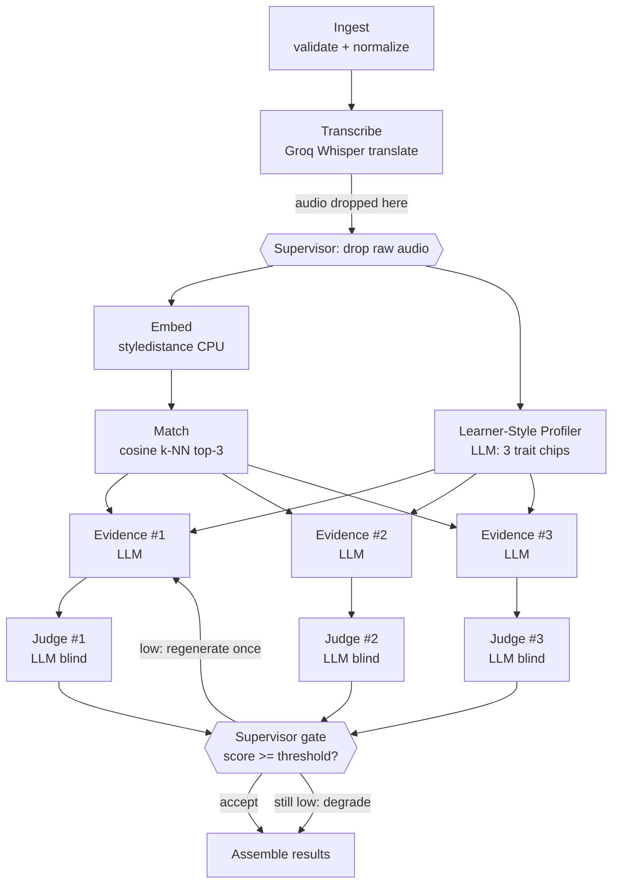
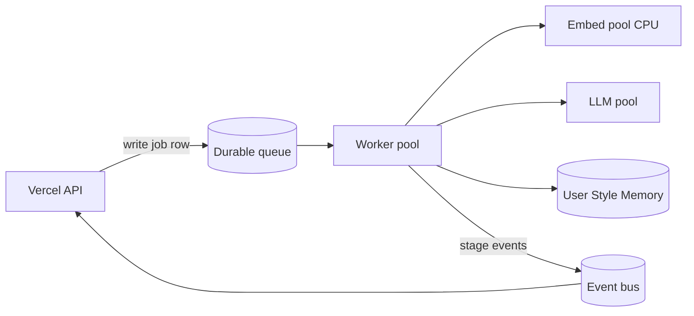

# Agent Architecture Design — Your Ideal Role Model

*2026-07-20. Codex-ready. Designs the multi-agent system for the hackathon upgrade. Primary goals
(from Sumin): **prevent bottlenecks** and **prevent inter-agent data conflicts**. Grounded in the
real code (`backend/app.py`, `backend/pipeline.py`, `backend/corpus.py`) and the
[why-panel-spec](branding/2026-07-19-why-panel-spec.md), not on assumption.*

---

## 0. Decision first (read this, skip the rest if rushed)

**The system is a deterministic DAG with a few LLM leaves — not a swarm of autonomous agents.**
So the right design is a **deterministic Supervisor** (plain Python, never an LLM) that orchestrates
**single-responsibility workers** over **one shared, append-only context object**, with parallelism
only where the work is truly independent.

- **Supervisor = code, not a model.** It sequences the DAG, fans work out, fans results in, and
  makes gate decisions by comparing numbers to thresholds. It never "decides what to do next" with
  an LLM. (This is the same rule you already set in HAIT: *facts are computed by code, only judgment
  goes to the model; the judge classifies, the gate filters.*)
- **Two kinds of worker, kept apart:** *deterministic workers* (audio → text → vector → ranked
  matches — reproducible, code) and *judgment workers* (the LLM steps: learner-style profile,
  evidence, confidence). SRP: each owns exactly one job.
- **Bottleneck fix is not a message queue.** For a one-request, one-day build a broker would *add*
  latency and failure surface. The real wins are: **load the heavy model + corpus once at startup**,
  **run the CPU embed off the event loop**, and **fan out the independent LLM calls** instead of
  looping them. A durable queue is designed here too, but it belongs to the platform tier and earns
  its place only when many users hit the box at once.
- **Conflict fix is ownership discipline, not locks.** One writer for shared state (the Supervisor),
  read-only shared singletons (model/corpus/config), and per-creator result cells keyed by id so two
  parallel workers never touch the same field.

**Two tiers, one line between them:**
- **Demo tier (build today):** in-process async orchestration, typed objects, no broker, no DB.
- **Platform tier (the vision to *show*, not build):** job queue + worker pool + a User Style Memory
  store. This is where "network effects" and "learning loop" live.

---

## 1. What the pipeline actually is (and the real bottlenecks)

Current flow (`pipeline.py`):

```
raw audio → Groq Whisper PLAIN translate → English text
          → styledistance embed → cosine k-NN → top-3
          → for each of 3: GPT-5.6 "why"  → results
```

Only two steps use a model's *judgment* (the "why", and the confidence check we are adding). Every
other step is deterministic. That single fact drives the whole design.

**Real bottlenecks, found in the code (not guessed):**

| # | Where | Problem | Cost |
|---|-------|---------|------|
| B1 | `pipeline.py:97` | `SentenceTransformer("StyleDistance/styledistance")` is constructed **inside every request's embed call** | Model reload (seconds→tens of seconds) on *every* match. The single biggest latency source. |
| B2 | `pipeline.py:39-40` | `load_creators()` + `load_vectors()` **re-read JSON + npz from disk per request** | Needless disk I/O + parse on the hot path. |
| B3 | `pipeline.py:43-55` | The 3 GPT "why" calls run in a **serial `for` loop**; learner style is implicitly recomputed per card | 3× LLM latency in series instead of ~1×; wasted tokens. |
| B4 | `app.py:41-52` | `async def match` calls the **synchronous** `pipeline.match()` | The whole run (Whisper + embed + 3 LLM calls) **blocks the event loop** — the server can serve only one request at a time. |
| B5 | everywhere | No timeout / retry / concurrency cap on Groq or OpenAI | Under any load, rate-limit 429s and one hung call stall the request. |

Every design choice below closes one or more of these.

---

## 2. The Supervisor: role and control flow

### 2.1 Role (what it is and is not)

The Supervisor is **one deterministic Python object** (async). It owns the *run*, not the *thinking*.

**It does:**
1. Create the `RunContext` (assign `run_id`), hold the single source of truth for the run.
2. Enforce stage order — run the DAG in topological order; nothing starts before its inputs exist.
3. Fan out independent work and fan results back in.
4. Apply **deterministic gates** — compare confidence scores to `thresholds` (from config) and decide
   accept / regenerate-once / degrade. Reproducible: same inputs + same model outputs → same decision.
5. Enforce **timeouts, one-retry, and a concurrency cap** per external call (closes B5).
6. Enforce the **retention red line** — drop raw audio the instant transcription returns. This is a
   Supervisor step, not left to a worker's discretion.
7. Emit a **stage trace** (for the demo UI and telemetry).

**It does NOT:**
- Call an LLM to choose the next step. Routing is static (the DAG); gating is numeric (thresholds).
- Hold business logic that belongs to a worker (it moves data, it does not measure or judge).

> Why deterministic: an LLM-router Supervisor is non-reproducible, hard to debug live on stage, and
> adds a whole extra latency + failure point for a decision that is really just "is score ≥ threshold".
> Your HAIT `Critic → Supervisor` split is exactly this pattern: LLM makes the *judgment*, code makes
> the *gate*.

### 2.2 Control flow (the DAG)



Read it as **three phases**:

- **Phase A — serial spine (real data dependencies, must be in order):**
  `Ingest → Transcribe → [drop audio] → Embed → Match`.
- **Phase B — fan-out (independent, run in parallel):**
  `Embed` and the `Learner-Style Profiler` both consume the transcript and do not depend on each
  other → run concurrently. Then `Evidence ×3` fan out (each card is independent), then `Judge ×3`.
- **Phase C — fan-in + gate:** Supervisor collects the 3 judge scores, compares to thresholds, and
  deterministically chooses accept / regenerate-once / degrade-to-fallback, then assembles the
  response. (Fallback = the neutral one-liner already specified in the why-panel-spec §6.)

---

## 3. Worker agents (Single Responsibility)

Each worker owns exactly one responsibility, takes a typed input, returns a typed output, and
**never writes shared state** (it returns; the Supervisor writes). Workers are split into
**deterministic** (facts, reproducible) and **judgment** (LLM). This is the SRP backbone.

### 3.1 Deterministic workers — "facts, by code"

| ID | Worker | Sole responsibility | In → Out | Notes / bottleneck closed |
|----|--------|--------------------|----------|---------------------------|
| W1 | **Ingest** | Validate + normalize the upload (format, size, length floor/cap) | `bytes` → `AudioRef` | Rejects bad input early; no ML. |
| W2 | **Transcribe** | Groq Whisper **PLAIN translate** audio→English | `AudioRef` → `english_text` | **Sole owner of the Groq call.** After it returns, Supervisor drops the audio. |
| W3 | **Embed** | styledistance English text → `style_vector` | `english_text` → `float[]` | Uses the **preloaded** model (closes **B1**); run via `to_thread` so CPU work never blocks the loop (closes **B4**). |
| W4 | **Match** | cosine k-NN of `style_vector` vs the **preloaded** corpus → ranked top-3 + scores | `float[]` → `RankedMatch[]` | Pure numpy over the in-memory corpus (closes **B2**). |

*(Sentence segmentation is a pure text util the profiler/evidence steps call — not promoted to a
full worker; promoting a one-line `split` to an "agent" would violate SRP by inventing a role.)*

### 3.2 Judgment workers — "opinion, by model"

| ID | Worker | Sole responsibility | In → Out | Notes |
|----|--------|--------------------|----------|-------|
| W5 | **Learner-Style Profiler** | The learner's own clip → **3 plain trait chips** (`learner_traits`) | `english_text` → `traits[3]` | Runs **once**, in parallel with Embed. The chips are the same on all 3 cards (why-panel-spec §5) — computing them once closes the waste in **B3**. |
| W6 | **Evidence Writer** (×3) | For one matched creator: `learner_traits` + our creator descriptors → `shared_lines` + `closer` | `(traits, creatorDescriptors)` → `Evidence` | Fanned out per creator. **Never** uses the creator's real words (legal red line) — only our `role` + `source_note`. |
| W7 | **Confidence Judge** (×3, blind) | Score one evidence set: is it grounded in the transcript, specific, plain (not horoscope)? | `(transcript, Evidence)` → `score + flags` | **Classifies only.** It does NOT decide accept/reject — that is the Supervisor's deterministic gate. Mirrors HAIT `Critic`. |

### 3.3 Platform-tier worker (design now, build later)

| ID | Worker | Responsibility | Why deferred |
|----|--------|---------------|--------------|
| W8 | **Memory** | Read/write the **User Style Memory** (past vectors, trait history) and compute change deltas ("your sentences got longer, you hedge less") | Needs accounts + opt-in + a DB the no-account MVP omits (PRD Phase 3). This is the "learning loop / long-term memory" story to *show*, not ship today. |

### 3.4 How this maps to your 6-agent sketch

Your proposal → this design, so nothing is lost and nothing is over-built for one day:

- *Transcript Analysis* → **W1 Ingest + W2 Transcribe** (+ segmentation util).
- *Thinking Pattern Analyzer* → **W5 Learner-Style Profiler** (the 3 chips).
- *Learning Style Analyzer* → **folded into W5 for the demo**; split out later if the results page
  needs a second lens. (Adding a distinct agent for it today is scope you cannot afford.)
- *Creator Matching* → **W3 Embed + W4 Match** (measurement is two SRP steps, not one).
- *Evidence Generator* → **W6 Evidence Writer**.
- *Confidence Judge* → **W7 Confidence Judge** (+ the deterministic Supervisor gate behind it).

---

## 4. Global state vs local state (the conflict-prevention core)

Data conflicts come from *two things writing the same place* or *shared mutable state without an
owner*. The design removes both by construction.

### 4.1 Global state (shared) — two kinds

**(a) Per-run state: one `RunContext`, append-only, single writer.**
Every worker receives the context (or just the slice it needs) and **returns** its output; **only the
Supervisor writes** the output back. Workers never mutate the shared object. This is what makes the
×3 fan-out safe.

```python
# demo-tier shape (Pydantic/dataclass) — Codex can implement directly
@dataclass
class RunContext:
    run_id: str
    # serial spine (each written once, by the Supervisor, in order)
    audio: AudioRef | None            # DROPPED to None right after W2 returns
    english_text: str | None = None
    style_vector: list[float] | None = None
    ranked: list[RankedMatch] = field(default_factory=list)
    # fan-out results, keyed by creator_id so parallel workers never share a cell
    learner_traits: list[str] = field(default_factory=list)      # written once by W5
    evidence: dict[str, Evidence] = field(default_factory=dict)  # W6 -> evidence[creator_id]
    judged: dict[str, Judgment] = field(default_factory=dict)    # W7 -> judged[creator_id]
    trace: list[StageEvent] = field(default_factory=list)        # append-only telemetry
```

**(b) Process-global singletons: read-only after load.**
The styledistance **model**, the creator **corpus** (vectors + descriptors), **config**
(thresholds, timeouts, concurrency cap, budgets), and **prompt templates**. Loaded **once** at
startup (FastAPI `lifespan`), never mutated per request. Read-only ⇒ no locks on the hot path ⇒ no
contention. (This is the fix for B1/B2 *and* a conflict fix at the same time.)

### 4.2 Local state (private to a worker)

Each worker's scratch: the decoded audio buffer (W1), the raw Groq response (W2), mid-computation
numpy arrays (W3/W4), the raw LLM completion before it is parsed to JSON (W5/W6/W7). Never shared;
discarded when the worker returns its typed output. A bug in one worker's scratch cannot corrupt
another's.

### 4.3 The four conflict-prevention rules (adopt verbatim)

1. **One writer for shared state.** Only the Supervisor writes `RunContext`. Workers return values.
   → no write-write races during fan-out.
2. **Shared singletons are immutable.** Model / corpus / config / prompts are loaded once and never
   mutated. → no locks, no torn reads on the hot path.
3. **Fan-out writes to keyed cells.** Each Evidence/Judge worker writes only `evidence[creator_id]`
   / `judged[creator_id]`. Two parallel workers never touch the same field. → parallelism is safe by
   construction, not by locking.
4. **Retention is a state-lifecycle step.** `audio` has a mandatory destruction point (set to `None`)
   the moment W2 returns, enforced by the Supervisor. → the red line is structural, not a reminder.

*(Platform tier adds one genuinely mutable shared store — User Style Memory — see §5.3 for the single
extra rule it needs.)*

---

## 5. Inter-agent data passing (async, and how bottlenecks are prevented)

### 5.1 Demo tier — in-process async (build this today)

**Passing:** typed Python objects handed between Supervisor and workers. No serialization, no broker,
no DB. Workers are `async def` with a typed input and a typed output.

**Concurrency (this is the bottleneck fix, closes B3/B4):**

```python
# inside the Supervisor.run(), sketch
ctx.english_text = await transcribe(ctx.audio)     # serial spine
ctx.audio = None                                   # retention red line (rule 4)

# Phase B: Embed (CPU) and Profiler (LLM) are independent -> run together
vec_task   = asyncio.to_thread(embed, ctx.english_text)   # CPU off the event loop (B4)
prof_task  = profile_learner(ctx.english_text)            # LLM I/O
ctx.style_vector, ctx.learner_traits = await asyncio.gather(vec_task, prof_task)

ctx.ranked = match(ctx.style_vector, CORPUS)              # numpy, instant

# Evidence x3 in parallel, bounded so we don't trip rate limits (B5)
sem = asyncio.Semaphore(CONFIG.max_llm_concurrency)
async def one(creator):
    async with sem:
        ev = await with_timeout_retry(write_evidence, ctx.learner_traits, creator)
        jg = await with_timeout_retry(judge_evidence, ctx.english_text, ev)
        return creator.id, ev, jg
results = await asyncio.gather(*(one(c) for c in ctx.ranked))
for cid, ev, jg in results:
    ctx.evidence[cid], ctx.judged[cid] = ev, jg          # keyed cells (rule 3)
```

**Bottleneck-prevention checklist (demo tier):**

1. **Preload heavy singletons at startup** (model + corpus in FastAPI `lifespan`). Removes the
   biggest cost (B1/B2). *This one change is the highest-leverage fix in the whole system.*
2. **Keep CPU work off the event loop** — embed via `asyncio.to_thread` (or a small process pool).
   The event loop stays free for the LLM I/O (B4).
3. **Fan out the independent LLM calls** — `asyncio.gather` for Evidence×3 and Judge×3. Turns 6
   serial latencies into ~1–2 (B3).
4. **Bound concurrency with a Semaphore** — respects Groq/OpenAI rate limits; backpressure instead of
   429 storms (B5).
5. **Timeout + one retry per external call**, then degrade (why-panel-spec §6 fallback). A single
   hung LLM call can never stall the whole run (B5).
6. **Stream stage events to the UI** (SSE): *"Listening → Measuring your style → Finding your matches
   → Checking the evidence."* Fixes *perceived* latency and doubles as the visible "agent pipeline"
   that scores Technological Implementation points.

### 5.2 Platform tier — where a queue finally earns its place

Move to a **durable job queue + worker pool** only when one of these is true (not before):
concurrent users exceed one box; the CPU embed needs its own pool separate from the LLM calls; or
Memory writes need durability and retry.



Rules that keep the queue from *creating* the problems it is meant to solve:

- **Never put audio on the bus.** Pass a **content-addressed pointer** (short-TTL object store);
  audio is deleted in-job (retention rule holds). Messages carry `run_id` + pointers, not payloads.
- **Idempotency key = `run_id`, at-least-once delivery + dedup.** A redelivered message re-uses the
  same run and cannot double-write. → no duplicate-processing "conflicts."
- **Event bus is for observability and the UI, the DAG stays authoritative for control.** Stage
  events (`transcribed`, `matched`, `evidence.ready`, `judged`) drive the progress UI and telemetry;
  they do **not** decide ordering. Do not let "event-driven" dissolve the DAG's guarantees — that is
  the classic trap where agents start racing.

### 5.3 The one real cross-user conflict (Memory) and its single rule

User Style Memory is the only genuinely mutable shared-across-requests state. It gets **one** rule:
**single-writer-per-user** — serialize writes for a given user via a per-user lock (or optimistic
concurrency with a row `version`). A learner's yesterday-vs-today comparison then always reads a
consistent history. (And the PRD red line still holds: a learner vector is never added to the creator
corpus and never returned as another user's match.)

---

## 6. Phasing — what to build today vs what to show

| Component | Demo tier (today, in Codex) | Platform tier (vision to narrate) |
|-----------|------------------------------|-----------------------------------|
| Supervisor | In-process async orchestrator | Same logic, driving a worker pool |
| W1–W4 (deterministic) | Build | Embed gets its own pool |
| W5 Learner-Style Profiler | Build (1 LLM call) | Same |
| W6 Evidence ×3 | Build (fan-out) | Same |
| W7 Confidence Judge ×3 | Build (this is the "wow": AI checks its own receipts) | Same |
| Singletons at startup | **Build (the key fix)** | Cached / warmed pools |
| Data passing | Typed objects + asyncio | Durable queue + event bus |
| W8 Memory / change tracking | **Stub or mock** for the demo screen | Real store, single-writer-per-user |

**Judging tie-in:** the deterministic-Supervisor + blind-Confidence-Judge pair is the part that reads
as real engineering (not "GPT wrote some text") — it *shows* the reasoning is checked, which is
exactly the Technological Implementation and Quality-of-Idea axes. The Memory/loop tier is the
Potential-Impact story you gesture at without building.

---

## 7. Codex build notes (concrete, minimal diff from current code)

1. **`app.py`** — add a FastAPI `lifespan` that loads the styledistance model + corpus **once** into
   app state. Make `/match` truly async; call the Supervisor, not a sync pipeline.
2. **New `backend/supervisor.py`** — the deterministic orchestrator (the sketch in §5.1).
3. **Refactor `pipeline.py` into workers** — `ingest`, `transcribe`, `embed`, `match`,
   `profile_learner`, `write_evidence`, `judge_evidence`. Move the model construction OUT of `embed`
   (it takes the preloaded model as an argument).
4. **`backend/config.py` (or `thresholds.yaml`)** — `max_llm_concurrency`, per-call `timeout_s`,
   `retry=1`, confidence `accept_threshold`. Supervisor reads these; nothing is hard-coded.
5. **`with_timeout_retry` helper** — wraps every Groq/OpenAI call (timeout + one retry + degrade).
6. **Evidence output = structured JSON** per why-panel-spec §5 (`learner_traits`, `shared_lines`,
   `closer`); keep the graceful fallback (§6).
7. **Keep the retention step explicit** — Supervisor sets `ctx.audio = None` immediately after
   `transcribe` returns.

None of this adds a paid dependency; it is a re-shape of the code that already exists, plus two new
LLM calls (profiler + judge).

---

## 8. One-line summary

A **deterministic Supervisor** runs a **DAG of single-responsibility workers** — deterministic ones
for measurement, LLM ones for judgment — over **one append-only context with read-only shared
singletons**; bottlenecks die by **preloading the model/corpus, threading the CPU step, and fanning
out the LLM calls**, and conflicts die by **single-writer state and id-keyed fan-out cells**. A
durable queue and a per-user Memory store are designed in but belong to the platform tier, not to
tomorrow's demo.
