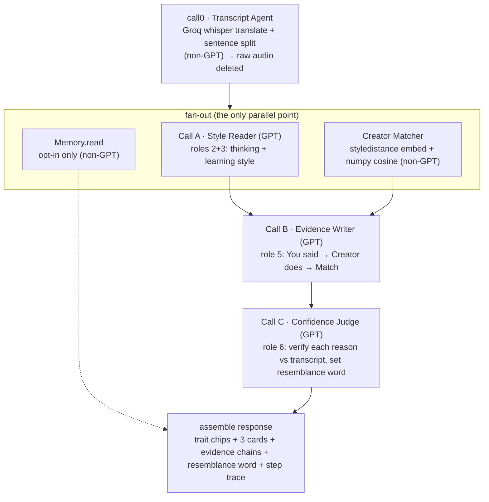

# Agent Architecture Spec — build-ready (single source of truth)

*2026-07-20. Consolidates the plan-stage work (Prompt 1 architecture, Prompt 2 agent contracts,
Prompt 3 red-team) into one document Codex can build from. Supersedes the scattered outputs and the
earlier merged-call draft. Pairs with `2026-07-20-strategy-ai-role-model-engine.md` (why) and the
branding docs (copy). The two defects found in red-team are already fixed here: the input length
gate and the English-only user-facing strings.*

---

## 0. Fixed assumptions (do not violate)

- Single synchronous request. Plain FastAPI `/match`. **No queue, no lock, no event bus, no
  background worker.** In-process `asyncio` only.
- No new framework (no LangGraph / CrewAI). Plain Python + Pydantic types.
- **3 real GPT-5.6 calls per request** (A, B, C). Transcription and ranking are tool calls, not GPT.
- **Privacy spine:** raw audio is deleted right after transcription. Nothing derived persists by
  default. The only thing that can persist is an **opt-in** style memory, and only the Memory Worker
  touches that store.
- **Demo-first:** any hard failure still returns something wherever a softened fallback is defined.
  The three creator cards must always render.

## 1. Pipeline graph

Execution order: `call0 → (A ∥ Matcher ∥ Memory.read) → join → B → C → assemble`. The only real
long pole is the 3 sequential GPT calls A→B→C.

## 2. Real call budget

| Step | Agent | Call type | GPT budget |
|------|-------|-----------|------------|
| call0 | Transcript Agent | Groq Whisper (translate) + deterministic split | No |
| Call A | Style Reader (roles 2+3) | **GPT-5.6** | **1** |
| — | Creator Matcher (role 4) | styledistance embed + numpy cosine | No |
| — | Memory Worker (read/write) | DB + deterministic diff, opt-in only | No |
| Call B | Evidence Writer (role 5) | **GPT-5.6** | **1** |
| Call C | Confidence Judge (role 6) | **GPT-5.6** | **1** |

**Total real GPT calls = 3 (A, B, C).** Confidence Judge is always a separate call, never merged.

## 3. Supervisor (`run_pipeline`)

A single async function inside `/match`. Deterministic routing (fixed order hardcoded in Python, the
LLM never decides the next step — the graph is a single fixed path, so LLM routing would only add
latency and non-determinism, and the demo must run the same way every time and show judges a
reproducible flow).

Responsibilities:
1. Call transcript (call0), then **delete raw audio immediately** (before anything downstream).
2. **Input gate** (see §7). If it fails, return the re-record message, run nothing else.
3. `asyncio.gather(style_reader, matcher, memory_read)` — the only parallel point.
4. Join, pass to Evidence Writer (B), then to Confidence Judge (C).
5. Assemble the final payload.
6. Emit a **step trace** (which step ran, when) — this trace is the data for the "reasoning
   visualization" hero screen.
7. Enforce all retry caps (≤1 each) and the **global 45s deadline** — on breach, return whatever is
   ready with a neutral fallback.

## 4. Agent contracts (condensed)

All user-facing strings are English, plain, no jargon, no em dash (see §8). `request_id` flows through
every call.

### call0 — Transcript Agent (non-GPT)
- **Mission:** raw audio → English transcript, split into sentences. Only source of the transcript.
- **In:** `{ audio_ref, source_lang|null, request_id }`
- **Out:** `{ transcript_en, sentences:[{id,text,start_ms,end_ms}], word_count, duration_ms, audio_deleted:true }`
- **Tools:** Groq `whisper-large-v3` (translate) + deterministic punctuation/regex split. No DB, no LLM.
- **Success:** transcript non-empty AND passes the input gate (§7). **`audio_deleted` must be true.**
- **Errors:** `ERR_AUDIO_TOO_SHORT` (retry 0), `ERR_ASR_TIMEOUT` (retry ≤1 → `ERR_ASR_FAILED`),
  `ERR_ASR_EMPTY` (retry 0). On fail: hard gate, nothing downstream runs, user sees
  `The match could not be completed. Please try again.`

### Call A — Style Reader (GPT, roles 2+3)
- **Mission:** from transcript only, extract how the learner talks (thinking pattern) and how they
  learn (learning style), each trait anchored to a real `sentence_id`.
- **In:** `{ transcript_en, sentences, creator_trait_vocabulary, request_id }`
- **Out:** `{ thinking_traits:[{trait_id,label,evidence_sentence_id,confidence}], learning_traits:[...], learner_quotes:[{sentence_id,text}], style_summary }`
- **Tools:** LLM only, transcript only. No DB, no creator library.
- **Success:** ≥3 thinking traits, every `evidence_sentence_id` exists in input.
- **Errors:** `ERR_LLM_TIMEOUT` / `ERR_SCHEMA_INVALID` (retry ≤1, stricter reprompt). Final fail
  `ERR_STYLE_FAILED` → degrade to matching-only (skip B, cards show a generic reason, no chips).

### Creator Matcher (non-GPT, role 4)
- **Mission:** rank the 26 hand-seeded creators against the learner's style vector, return top-3.
- **In:** `{ transcript_en, request_id }` (independent of Call A)
- **Out:** `{ top_matches:[{creator_id,creator_name,channel_url,cosine_score,descriptors[],rank}], low_confidence }`
- **Tools:** `styledistance` embedding + numpy cosine + read-only `creators.seed.json`. No LLM, no user DB.
- **Success:** exactly 3, descending, no dup, each has `channel_url` + `descriptors`.
- **Errors:** `ERR_EMBED_FAILED` (retry ≤1 → hard fail), `ERR_CORPUS_EMPTY` (retry 0). If top score
  `< 0.4`, set `low_confidence:true` (UI shows "partial resemblance"), do not fail.

### Call B — Evidence Writer (GPT, role 5)
- **Mission:** turn A + Matcher output into 2–3 checkable evidence chains per creator:
  **You said → Creator does → Match** + one plain why-summary. Never re-derive from raw text; only
  use the provided `learner_quotes` and `descriptors` (anti-hallucination).
- **In:** `{ learner_quotes, thinking_traits, learning_traits, matches, request_id }`
- **Out:** `{ why_panels:[{creator_id, resemblance(placeholder), learner_trait_chips[], evidence:[{trait_id, you_quote:{sentence_id,text}, creator_descriptor, match_reason}] }] }`
- **Success:** each panel ≥2 evidence items; each `you_quote.sentence_id` exists; each
  `creator_descriptor` is really in that creator's `descriptors`.
- **Errors:** `ERR_LLM_TIMEOUT` / `ERR_SCHEMA_INVALID` / `ERR_EVIDENCE_UNGROUNDED` (retry ≤1). Final
  fail → cards + trait chips only, no chains, resemblance generic.

### Call C — Confidence Judge (GPT, role 6) — the hero, never merged into B
- **Mission:** independently verify each of B's reasons against the transcript; prune unverifiable or
  generic ones; set the final resemblance word. **Prune + grade only — it never triggers
  regeneration** (this is what prevents any B↔C loop).
- **In:** `{ why_panels, cited_sentences, request_id }` — receives **only the cited sentences**, not
  the whole transcript (keeps verification integrity while cutting input + latency).
- **Out:** `{ verified_panels:[{creator_id, resemblance(strong|clear|partial), evidence:[{trait_id,verdict(kept|dropped),verifiable,grounded,note(internal)}], judge_summary(internal)}], overall_confidence, judge_skipped }`
- **Success:** every evidence item gets a verdict, every panel gets a resemblance word. Dropping items
  is allowed; structure still returns.
- **Errors:** `ERR_LLM_TIMEOUT` / `ERR_SCHEMA_INVALID` (retry ≤1). Final fail → **do not block**: pass
  B's output through unverified, set `resemblance=partial`, `judge_skipped=true`, hide the confidence
  badge.

### Memory Worker (non-GPT, opt-in only — the only DB writer)
- **Mission:** on opt-in only, store/read a derived style vector + summary keyed by an opaque token,
  and compute a deterministic diff vs the previous profile.
- **In (read):** `{ mode:"read", opt_in, token, request_id }` · **(write):** `{ mode:"write", opt_in, token, style_vector, style_summary }`
- **Out (read):** `{ found, previous, deltas:[{metric,before,after,direction}] }` · **(write):** `{ token, stored, captured_at }`
- **Rule:** `opt_in == false` → no-op `{ skipped:true, reason:"not_opted_in" }`, writes nothing.
- **Errors:** `ERR_MEMORY_DB_UNAVAILABLE` (retry ≤1 → drop memory panel, `memory_available:false`).
  Never blocks the core result. `not_opted_in` is a clean skip, not an error.
- **Demo:** seeded — 1 demo user + 2 recordings pre-stored, only `read` is shown ("your profile
  changed like this"). No live `write` in the demo; the opt-in toggle is shown but off.

## 5. Latency budget + mitigations

| Step | typical | p90 | timeout |
|------|---------|-----|---------|
| call0 (Groq translate + split) | 6s | 10s | 15s |
| Call A ∥ Matcher ∥ Memory (A dominates) | 10s | 16s | A 20s / Matcher 5s |
| Call B | 11s | 16s | 20s |
| Call C | 9s | 14s | 18s |
| **Total** | **~36s** | **~56s** | global deadline **45s** |

The 3 sequential GPT calls (A→B→C) are the only long pole; Groq is not the bottleneck. Mitigations:
- **Token caps (biggest lever):** A `max_tokens≈500`, B `≈700`, C `≈500`. If GPT-5.6 exposes a
  reasoning-effort setting, set A/B to low. *(Verify exact param names against the real API at build.)*
- **Shrink Judge input:** send C only the cited sentences, not the full transcript.
- **Precompute creator vectors at startup** (26 seed rows embedded once), so Matcher is cosine-only.
- **Progressive reveal:** render the 3 cards as soon as Matcher finishes (~12s) in a "checking the
  reasons" state, then fill evidence when B/C land. Perceived latency drops from ~36s to ~12s.
- **Stream the step trace** so the reasoning-viz never shows a frozen screen, even at p90.
- **Demo cache:** the seeded demo recordings cache the full call0→C result, so re-runs are instant.

**Global deadline 45s:** on breach, emit whatever is ready + neutral fallback.

## 6. Loop safety

- **The default pipeline builds no B↔C feedback loop.** The Judge prunes and grades; it does not
  request regeneration. This alone removes the loop at the source.
- **Rewrite is an exceptional safety valve only:** `max_rewrites = 1` (so B ≤2 calls, C ≤2 calls),
  enforced by a Supervisor counter, not by the LLM.
- **Rewrite fires only** when a panel's kept evidence hits 0 (its Why would be empty) **and**
  `elapsed < 20s`.
- **After one rewrite still insufficient → neutral termination, not pass:** `resemblance=partial`,
  `judge_verdict:insufficient`, keep the card + chips, never fabricate confidence.
- Worst-case GPT calls = A1 + B2 + C2 = **≤5**. Global 45s deadline is the final backstop.

## 7. Input length gate (FIXED: was 30s)

Gate right after call0, before fan-out, judged on **word count** (silence inflates duration, so words
are the trustworthy signal):
- **Hard floor:** `< ~45s OR < ~120 words` → `ERR_AUDIO_TOO_SHORT`, user sees
  `Please talk a little longer, about a minute or two.`
- **Soft target:** 60–120s. The 45–60s / 120–180 word band passes but sets
  `match_confidence_capped=true` → the Judge caps resemblance at `clear` max, framed as "based on a
  short sample".
- Contract pre-condition becomes **"≥45s AND ≥120 words, target 60–120s"** (not "30s–3min").

## 8. Copy rules + field separation (FIXED: was Korean)

All user-facing strings are **plain English, no jargon, no em dash, resemblance as a word**.

- **Exposed fields** (must obey copy rules): `match_reason`, `learner_trait_chips`, `resemblance`,
  fallback copy, user error messages.
- **Internal fields** (English, jargon fine, never shown): `trait_id`, `verdict`, `verifiable`,
  `grounded`, `note`, **`judge_summary`**. The results screen shows only the resemblance word + the
  verified evidence lines, never `judge_summary`.
- **Deterministic guard (safety net):** right before the Supervisor returns, scan exposed fields with
  an em-dash regex + a jargon blocklist ("embedding", "style vector", "descriptor", and "shadow" in
  marketing). On a hit, strip or swap to neutral copy. Do not rely on the LLM "remembering" to write
  English. In the Why panel, draw the chain arrow as a label row or the word "matches", never an em dash.
- Example corrections: `match_reason` → `You both open with a question before giving your answer.`
  · generic fallback → `These two build sentences in a similar way. We are showing the clearest overlap we found.`

## 9. State model

- **Local, request-scoped, volatile:** transcript, style JSON, style vector, top-3, evidence JSON,
  judge verdict, and the `PipelineContext` trace accumulator (single writer = Supervisor). All gone
  when the request ends. No concurrent multi-writer state → no race by construction.
- **The only persistent state:** opt-in User Style Memory (opaque-token-keyed derived vector +
  summary). **Storage is separate** from the read-only creator seed library. Matcher reads seed only;
  the memory DB is touched by the Memory Worker only, on opt-in only.

## 10. Real vs mock cut line (for the demo)

**Real (build these two heroes):**
- The full pipeline: call0 + (A ∥ Matcher) + B + C, 3 GPT calls, ASR, cosine.
- Reasoning visualization (from the step trace) and the evidence-chain Why panel with the Judge's
  resemblance word. Confidence Judge runs for real — it is the technical hero.
- Privacy path: raw audio deleted right after call0; derived data is request-local.

**Mock / vision (static, seeded, no auth, labeled "Coming soon"):**
- Personal Language Memory + change-tracking (seeded 1 user / 2 recordings, behind the opt-in toggle).
- The learning loop, the creator-network cycle, the Language Twin — diagrams/mockups only.

**Demo reliability:** drive the live demo and the recording from the **seeded cache** (instant,
never stalls, since p90 ~56s can exceed the 45s deadline). Keep one true live run only as optional
proof.

## 11. Codex build order

1. Wire `run_pipeline` skeleton: call0 → gate → `asyncio.gather(A, Matcher, Memory.read)` → B → C →
   assemble + step trace. Deterministic order, global 45s deadline, per-step timeouts, retry ≤1.
2. Precompute the 26 creator vectors at startup.
3. Implement Call A, B, C prompts returning the schemas in §4 (Pydantic models).
4. Input gate (§7) + deterministic copy guard (§8).
5. Progressive reveal + step-trace streaming to the frontend (heroes).
6. Seed the demo cache (1 user, 2 recordings) for reliable demo playback.
7. Leave Memory `write` and all §10 "vision" items as mock/seeded only.

## 12. README one-liner (Build Week requirement)

*"Codex built a deterministic FastAPI orchestrator that runs GPT-5.6 as a 3-call reasoning pipeline —
read the learner's speaking style, write evidence chains against their own words, then a separate
Confidence Judge pass verifies every claim against the transcript and drops anything it cannot find —
so the match is reasoned and checkable, not a vibe."*
